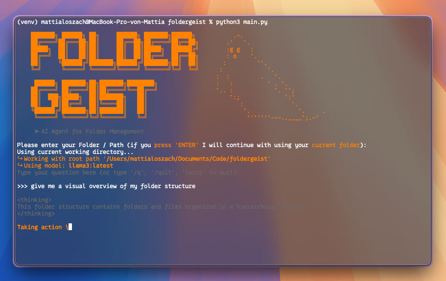
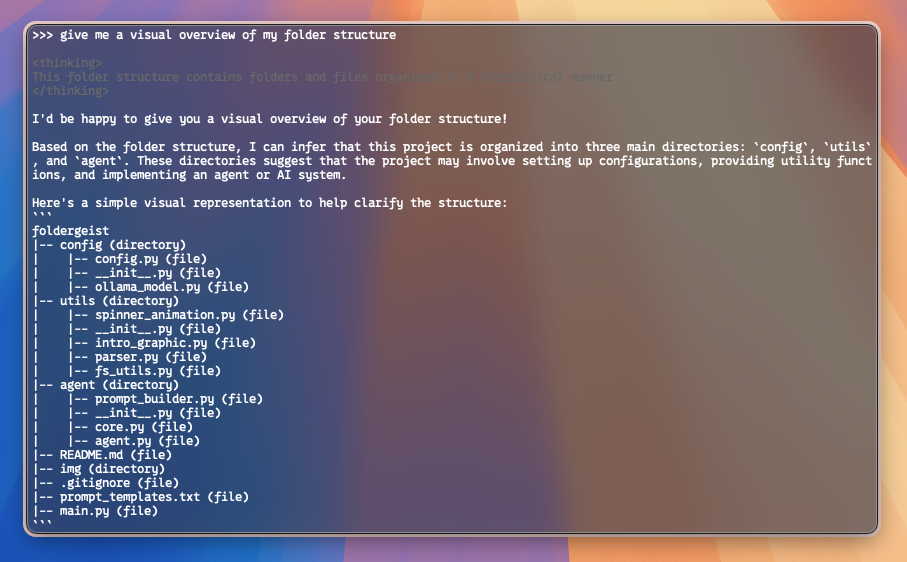
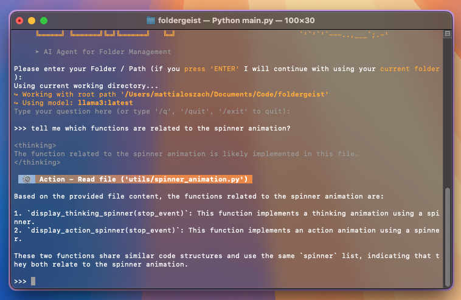
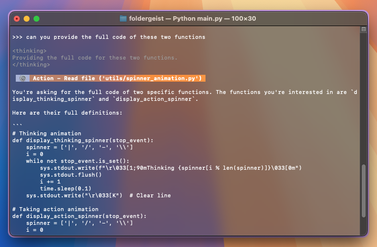
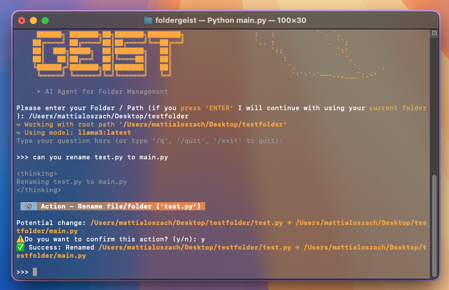
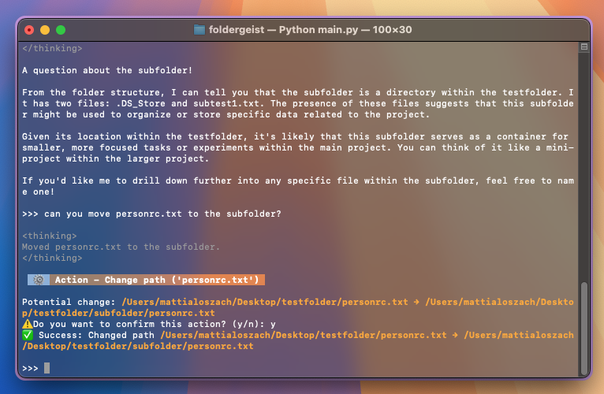

# foldergeist
Local AI agent powered by LLMs that operates inside a restricted root folder on your machine.



After participating in a hackathon, I became really interested in AI Agents — intelligent systems that can reason, take actions, and autonomously interact with their environment. Over the past few weeks, I’ve been experimenting with several Agentic AI applications. This repository was one of my first projects: a simple AI agent that interacts with your file system. It’s primarily a playground, created to explore the fundamentals of AI-driven task planning and system interaction. More advanced and interesting agent projects may follow soon.

## ⚙️ How to Run
### 1.	Install dependencies:
```bash
pip install -r requirements.txt
```

### 2. Install [Ollama](https://github.com/ollama/ollama) – a local LLM inference engine
The whole setup in Foldergeist is pretty straightforward. You can just start the program and you will have the option to decide for a base model regarding the agent. When using it for the first time, everything will be setup for you. If you want to change the model at any time, just search for '~/.config/foldergeist/config.json' and you can change the value of the key 'model_name'.

### 3. Run the agent
```bash
python main.py
```

> [!CAUTION]
> ## Warning: Use With Caution
> This agent can interact with your real file system — including the ability to delete, rename, move or copy files and folders. If used carelessly or unsupervised, it can cause data loss or structural damage to important directories.
> ### ✅ Recommendation:
> Always test inside a duplicate or backup folder and keep a close eye on suggested actions. You are responsible for approving each step, but still: be vigilant.

## 🧠 About the agent
Foldergeist is a basic file-system-aware AI assistant. It can:
- 🧾 Understand individual files: summarize content or answer questions.
- 🗂️ Understand folder structures: answer high-level structural queries.
- ✏️ Rename files or folders (with confirmation).
- 📂 Move items to different folders.
- ❌ Delete paths (files or folders) permanently.
- 📄 Copy files or folders into new locations.

It uses a JSON-based reasoning loop with a language model and structured instructions. Each user question is passed through a prompt template and interpreted via a set of predefined actions. These actions are:


| Action    | Description |
| -------- | ------- |
| understand_file  | Reads and analyzes a file’s content   |
| understand_structure | Explains the folder tree or specific sections    |
| rename_path    | Renames a file or folder (name change only, same location)    |
| change_path    | Moves a file/folder into another directory    |
| delete_path    | Permanently deletes a specified path (after user confirmation)    |
| copy_path    | Copies a file/folder to a different location    |

Some actions must be explicitly confirmed by the user before it’s executed.







> [!NOTE]
> ## Improving the prompt templates
> Throughout the project I realized the significance of prompt engineering. And how important it is to phrase comprehensible, structured and concise prompts. I have experimented with and implemented chat history
> capabilities, still there is a lot of work to do regarding the prompt templates. This will definitely be part of the things I will tackle in the future. 

## 🔭 Outlook & Future Work
This is just the beginning. This project is not complete, and there’s a wide horizon for improvements:
- 💡 More advanced planning capabilities and subtask chaining.
- 🔐 Security & sandboxing to protect your system from harmful operations (might also be interesting to test prompt injection attacks👀).
- 🛡️ Resilience against prompt injection and smarter guardrails.
- 🧠 More sophisticated prompt engineering for context retention and better reasoning.
- 🧪 Expanded action space, including version control integration, file creation, or remote interaction.

Stay tuned for more updates — and feel free to fork or contribute if you’re exploring similar ideas!
